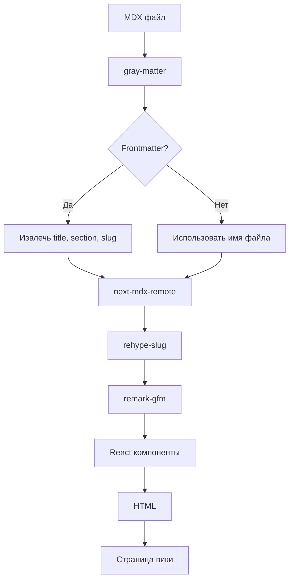
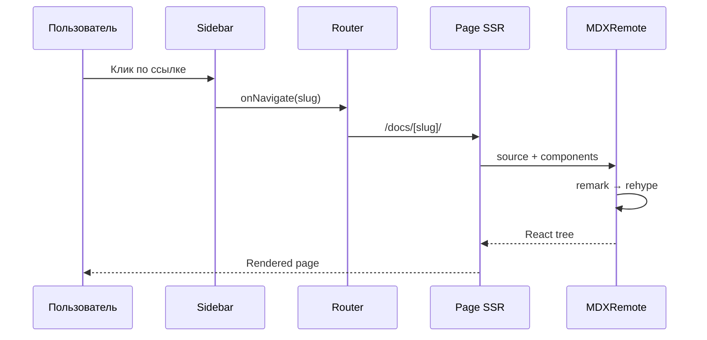
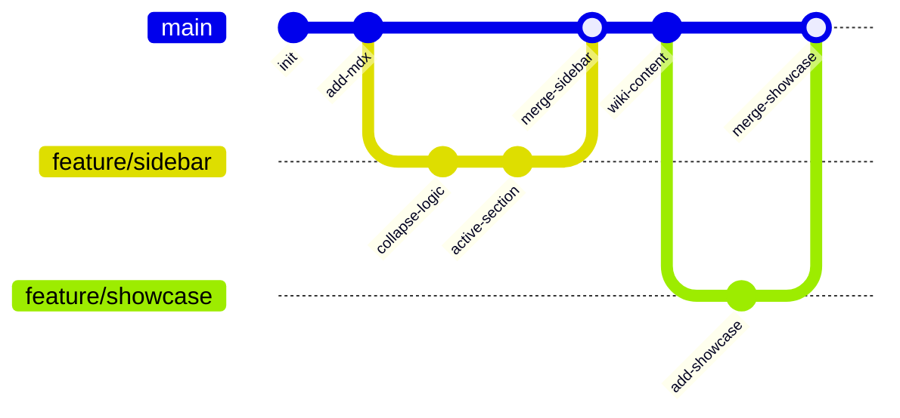

## Code Blocks

### Python

```python
class Pipeline:
    """Основной класс конвейера обработки данных."""

    def __init__(self, steps: list[Step], max_retries: int = 3):
        self.steps = steps
        self.max_retries = max_retries
        self._context: dict[str, Any] = {}

    async def execute(self, input_data: dict) -> dict:
        result = input_data
        for step in self.steps:
            for attempt in range(self.max_retries):
                try:
                    result = await step.run(result, self._context)
                    break
                except RetryableError as e:
                    if attempt == self.max_retries - 1:
                        raise PipelineError(f"Step {step.name} failed: {e}")
                    await asyncio.sleep(2 ** attempt)
        return result
```

### TypeScript

```typescript
interface Config {
  theme: "light" | "dark" | "system";
  locale: string;
  features: Record<string, boolean>;
}

function createConfig(overrides: Partial<Config> = {}): Config {
  const defaults: Config = {
    theme: "system",
    locale: "ru",
    features: {
      search: true,
      edit: true,
      toc: true,
    },
  };
  return { ...defaults, ...overrides };
}
```

### SQL

```sql
SELECT
    p.name AS project,
    COUNT(c.commit_id) AS commits,
    COUNT(DISTINCT a.author_id) AS contributors,
    MAX(c.created_at) AS last_activity
FROM projects p
LEFT JOIN commits c ON c.project_id = p.id
LEFT JOIN authors a ON a.id = c.author_id
WHERE p.status = 'active'
GROUP BY p.id, p.name
HAVING COUNT(c.commit_id) > 10
ORDER BY commits DESC
LIMIT 20;
```

### Bash

```bash
#!/usr/bin/env bash
set -euo pipefail

REPO="$1"
TARGET="/home/z/my-project"

if [ -d "$TARGET/.git" ]; then
    cd "$TARGET"
    git pull --rebase origin main
else
    git clone "$REPO" "$TARGET"
fi

bun install
bun run build
```

### Rust

```rust
use std::collections::HashMap;
use tokio::sync::RwLock;

#[derive(Debug, Clone)]
struct Cache<K, V> {
    store: RwLock<HashMap<K, V>>,
    max_size: usize,
}

impl<K: Eq + std::hash::Hash + Clone, V: Clone> Cache<K, V> {
    fn new(max_size: usize) -> Self {
        Self {
            store: RwLock::new(HashMap::new()),
            max_size,
        }
    }

    async fn get(&self, key: &K) -> Option<V> {
        let store = self.store.read().await;
        store.get(key).cloned()
    }

    async fn insert(&self, key: K, value: V) -> Option<V> {
        let mut store = self.store.write().await;
        if store.len() >= self.max_size {
            let oldest = store.keys().next()?.clone();
            store.remove(&oldest);
        }
        store.insert(key, value)
    }
}
```

## Mermaid Diagrams

### Flowchart



### Sequence Diagram



### GitGraph



## Таблицы

### Параметры

| Параметр       | Тип    | По умолчанию   | Описание              |
| -------------- | ------ | -------------- | --------------------- |
| `title`        | string | —              | Заголовок страницы    |
| `section`      | string | —              | Секция навигации      |
| `sectionOrder` | number | 0              | Порядок секции        |
| `order`        | number | 0              | Порядок внутри секции |
| `slug`         | string | из имени файла | URL-идентификатор     |

### Сравнение подходов

| Критерий        | Покомпонентный                | Универсальный (event delegation) |
| --------------- | ----------------------------- | -------------------------------- |
| Новый компонент | Нужно добавлять expand-логику | Работает из коробки              |
| Объём кода      | Растёт с каждым компонентом   | Фиксированный (1 обёртка)        |
| Обслуживание    | Риск рассинхрона              | Единая точка изменения           |
| Тестирование    | Каждый компонент отдельно     | Один showcase-файл               |

## Изображение


## Callout

<Callout type="info" title="Замечание">
  Это showcase-файл. Он покрывает все типы компонентов шаблона и служит
  регрессионным тестом после изменений.
</Callout>

<Callout type="warning" title="Важно">
  При добавлении нового типа контента в шаблон, обязательно добавьте пример в
  этот файл.
</Callout>

<Callout type="tip" title="Совет">
  Используйте Cmd+K для быстрого поиска по всей документации.
</Callout>

## Списки

### Нумерованный

1. Создать MDX-файл с frontmatter
2. Добавить в `src/content/docs/`
3. Страница автоматически появится в навигации
4. Проверить showcase для регрессии

### Маркированный

- Код с подсветкой синтаксиса
- Mermaid-диаграммы (flowchart, sequence, gitgraph)
- GFM-таблицы
- Изображения
- Callout-компоненты
- Внутренние и внешние ссылки

### Задачи (GFM)

- [x] Code blocks с подсветкой
- [x] Mermaid-диаграммы
- [x] Таблицы
- [x] Изображения
- [x] Callout'ы
- [ ] Видео (не реализовано)
- [ ] Встроенные PDF (не реализовано)

## Цитаты

> Этот репозиторий — не просто проект, а шаблон (template), который клонируется и используется как основа для создания баз знаний.

> Если вы не читали файл, не делайте заявлений о его содержимом.
> — Принцип анти-галлюцинации

## Внутренние ссылки

- [Об авторе](/docs/ob-avtore/)
- [Карта экосистемы](/docs/karta-ekosistemy/)
- [Vision & Goals](/docs/vision-goals/)
- [Рабочий процесс в песочнице](/docs/rabota-v-pesochnitse/)
- [Верификация](/docs/verifikatsiya/)

## Внешние ссылки

- [Next.js Documentation](https://nextjs.org/docs)
- [MDX Specification](https://mdxjs.com/)
- [Mermaid.js](https://mermaid.js.org/)
- [GitHub Flavored Markdown](https://docs.github.com/en/get-started/writing-on-github/getting-started-with-writing-and-formatting-on-github/basic-writing-and-formatting-syntax)

## Зачёркнутый текст и горизонтальная линия

Этот текст ~~перечёркнут~~ актуален.

---

Конец showcase-файла.
